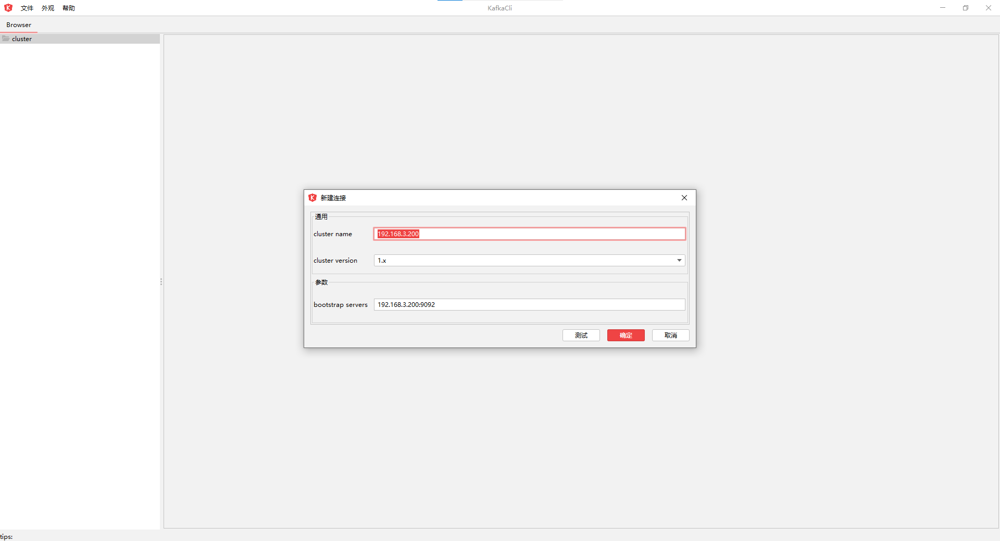
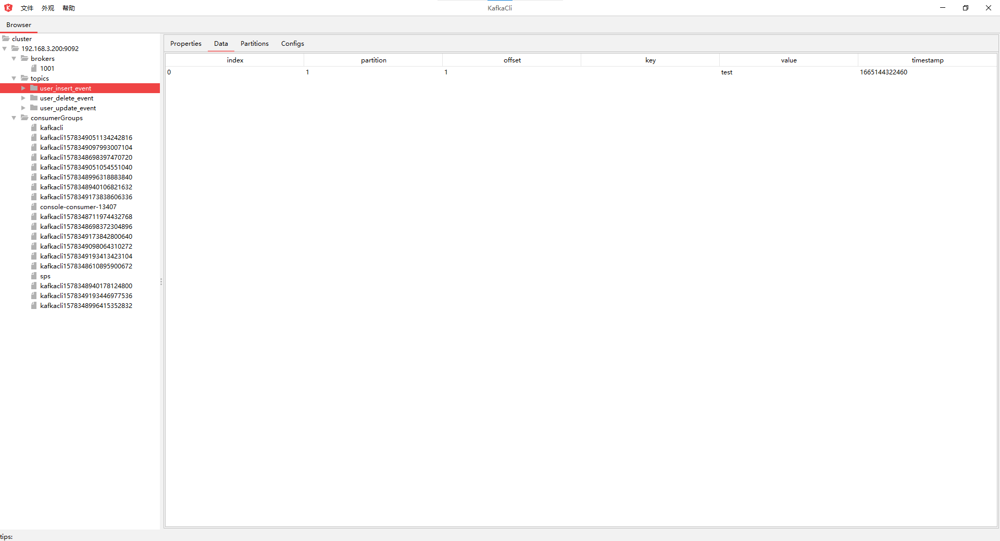
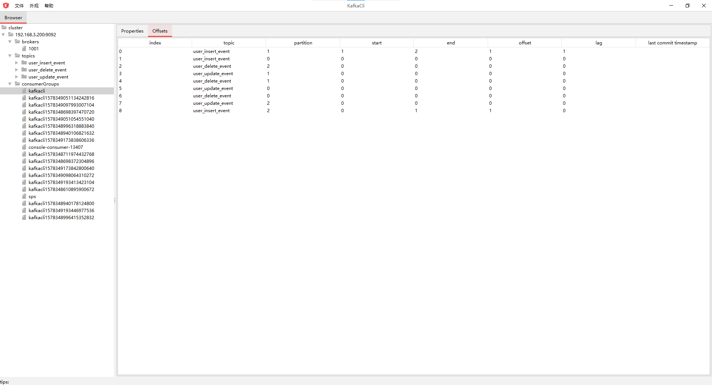
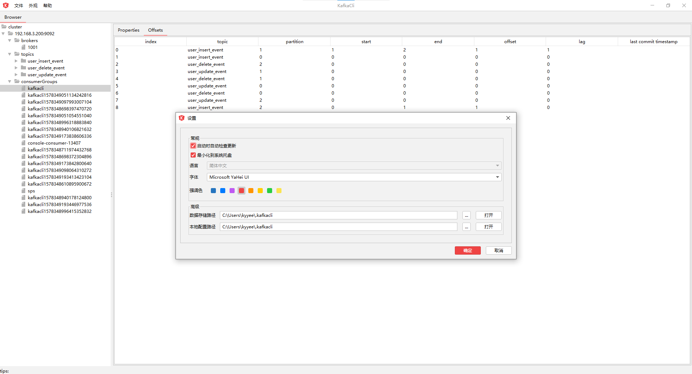
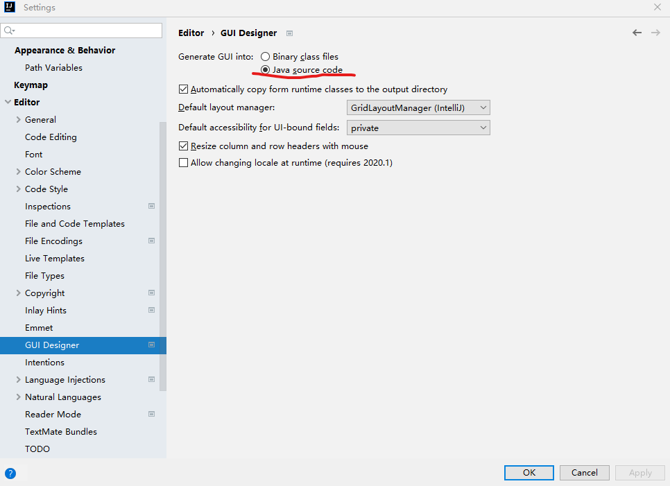

# kafkacli

kafka桌面客户端

## 支持的平台

**Windows** • ~~Linux~~ • ~~macOS~~

## 截图速览

### 新建连接

### topic消费详情

### 消费组offset详情

### 系统配置

## 支持的功能

+ broker信息查询
+ topic信息查询，消息消费
+ consumer group信息查询

## TODO LIST

+ topic消息生产
+ consumer group offset修改
+ topic修改

## 开发指导
JDK版本要求：**openjdk 17**  
在你开始开发之前， **请按下图设置IntelliJ IDEA**， 然后执行 **maven clean**。

